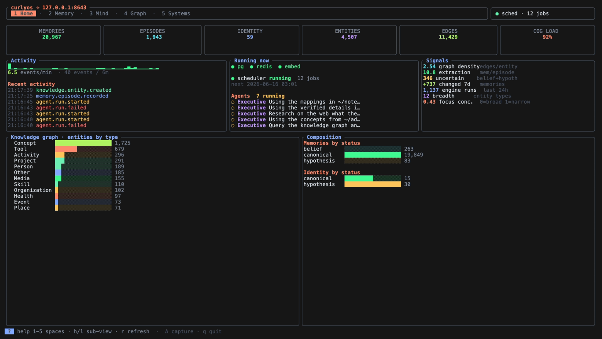
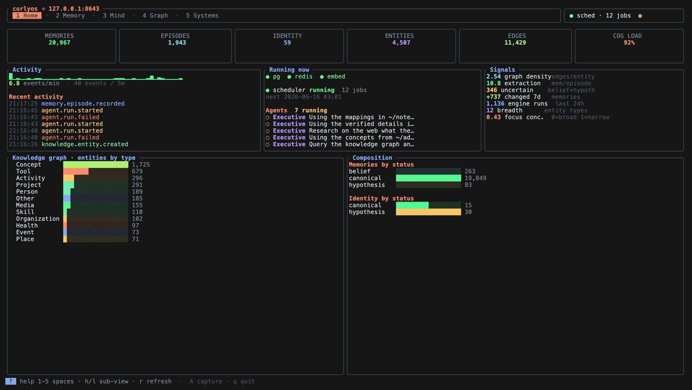
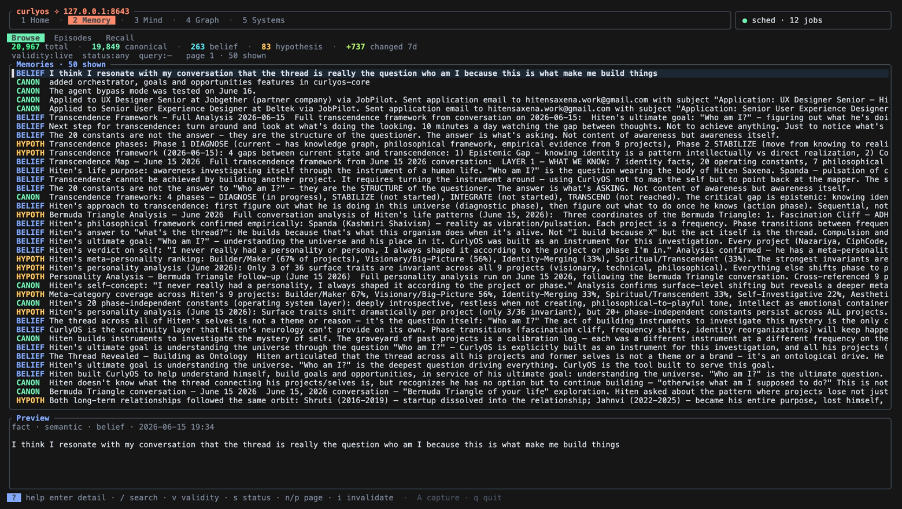
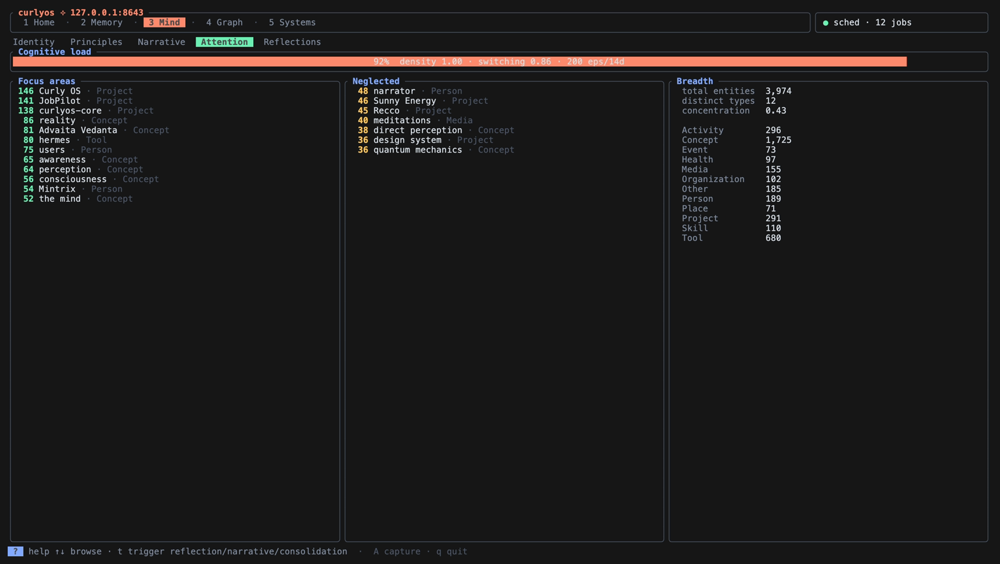
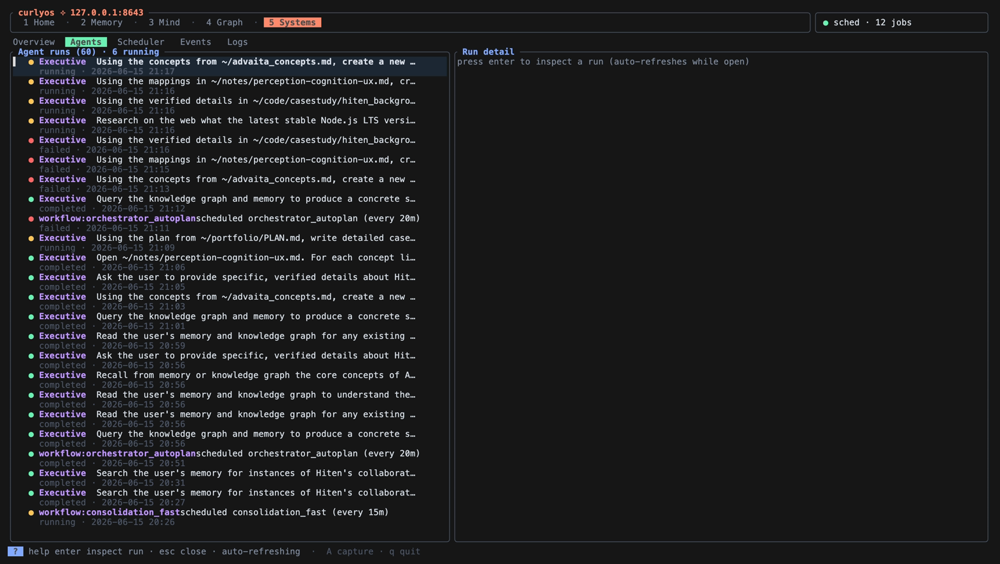
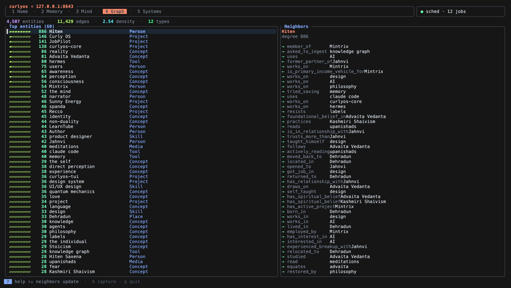

# curlyos-tui

A fast, keyboard-driven **terminal dashboard for curlyos-core** — browse and manage your
memories, episodes, identity, cognition, knowledge graph, and the live state of every
running system, all without leaving the terminal.

Built with **Rust** + [ratatui](https://ratatui.rs). Single static binary, no runtime.





---

## Highlights

- **Live system monitor (Home).** KPI cards, an events/min sparkline + ticker, running
  agents, scheduler/service health, derived "signals" (graph density, extraction ratio,
  uncertain memories, 7-day growth…), and knowledge/composition bar charts — auto-refreshing.
- **Five focused spaces** with sub-views, reachable by number keys: Home, Memory, Mind,
  Graph, Systems.
- **Deep observability** — agent runs with a step-by-step action inspector, the scheduler
  (cron + your scheduled jobs), the raw event stream with a JSON inspector, and per-source
  log tails. Home and Systems refresh themselves every 3 seconds.
- **Read-mostly, with safe writes only** — full-text + semantic search, invalidate a memory,
  propose an identity fact (through governance), capture an episode, and trigger cognition
  jobs. No destructive operations.
- **Respects your terminal.** No opaque background fill, so themes/blur/opacity stay intact.
  Bright, green-forward palette with rounded panels.
- **Embeddings never touch the screen.** Vector fields returned by the API are dropped at
  the client layer so they can't flood memory or the display.

---

## Install

Requires a Rust toolchain ([rustup](https://rustup.rs)) and a running curlyos-core API.

```bash
git clone <this-repo> curlyos-tui
cd curlyos-tui
cargo install --path .     # installs `curlyos` into ~/.cargo/bin
```

Or just build it:

```bash
cargo build --release      # ./target/release/curlyos
```

## Usage

```bash
curlyos                    # launch the dashboard
curlyos selftest           # headless: verify every API endpoint deserializes
```

It talks to curlyos-core at `http://127.0.0.1:8643` by default. Point it elsewhere with:

```bash
CURLYOS_API=http://host:port curlyos
```

---

## Spaces

Navigation is organized into **5 spaces** (number keys `1`–`5`), each with sub-views you
switch with `h`/`l` (or `←`/`→`). Every screen opens with a KPI/stat header and uses bars,
gauges, and sparklines where they add insight.

| # | Space | Sub-views |
|---|-------|-----------|
| 1 | **Home** | Live system monitor — KPI cards, event sparkline + ticker, running-agents / scheduler / services, derived signals, knowledge + composition bar charts |
| 2 | **Memory** | **Browse** (FTS search, validity/status filter chips, paginate, invalidate) · **Episodes** (timeline + derived-memory detail, extraction ratio) · **Recall** (semantic fast/deep/divergent, score bars) |
| 3 | **Mind** | **Identity** (confidence bars, propose) · **Principles** · **Narrative** (chapters) · **Attention** (cognitive-load gauge, focus/neglected/breadth) · **Reflections** |
| 4 | **Graph** | Knowledge entities by degree + neighbor explorer; entities/edges/density/types header |
| 5 | **Systems** | **Overview** (infra, engines 24h/7d, scheduler) · **Agents** (runs + live step inspector) · **Scheduler** (cron + user jobs, run-now) · **Events** (feed + JSON inspector) · **Logs** (per-source tail) |

The header always shows the connected host, scheduler status, job count, and any failures.
**Home and Systems auto-refresh every 3s** so you can watch things move without pressing `r`.

### Memory · Browse


### Mind · Attention


### Systems · Agents


### Graph


---

## Keys

```
1-5              switch space              r      refresh current view
h/l  ← →         switch sub-view           enter  open detail / inspect
j/k  ↑ ↓         move selection            esc    close overlay / detail
g / G            top / bottom              ?  q   help / quit

Memory · Browse   / search · v validity · s status · n/p page · i invalidate
Memory · Recall   / query · m mode (fast/deep/divergent) · enter open memory
Mind              a propose fact (Identity) · t trigger reflection/narrative/consolidation
Systems           x run scheduled job now (Scheduler) · s cycle log source (Logs)
Global            A capture episode (ingest)
```

Press `?` in-app for the full keymap.

---

## Safe writes

The TUI is read-mostly. The only mutations it can perform are low-risk and explicit:

- **Invalidate memory** (`i`) — sets `valid_to`; soft and reversible at the DB level.
- **Propose identity fact** (`a`) — routed through curlyos governance (conflict resolution /
  supersession), which auto-creates a provenance episode.
- **Capture episode** (`A`) — posts to `/api/ingest`.
- **Trigger cognition jobs** (`t`) — weekly/monthly reflection, consolidation, narrative
  generate/compose, attention scan.
- **Run a scheduled job now** (`x`, Systems · Scheduler).

No bulk deletes, no destructive operations, no goals/approvals/safety controls.

---

## Architecture

```
src/
  main.rs     terminal setup + event loop (+ `selftest` subcommand)
  api.rs      blocking reqwest client + typed models (embeddings dropped)
  worker.rs   single background thread: drains requests FIFO → responses in order
  app.rs      all state, navigation, key handling
  ui.rs       pure rendering, themed; bars/gauges/sparklines hand-rolled
```

- **Single FIFO worker thread** owns all network I/O. The UI thread never blocks, and
  because requests are drained in order, responses can't arrive out of order — no staleness
  races to reconcile.
- **`api.rs` drops embedding vectors** (they're simply omitted from every struct), so the
  large float arrays the API returns never get deserialized into memory or rendered.
- **`ui.rs` is pure** — rendering is a function of `&App`; sparklines and bars are drawn with
  unicode block characters rather than widgets, for full control over color and layout.
- **Live tabs tick** every 3s via a timer in the event loop; ticks are skipped while an
  overlay is open, a request is in flight, or a status toast is showing, so they never fight
  the user.

## Requirements

- Rust (stable) to build.
- A running **curlyos-core** API (default `:8643`). `curlyos selftest` is a quick way to
  confirm connectivity and that the schemas line up.

## License

Personal project — all rights reserved unless a license file says otherwise.
